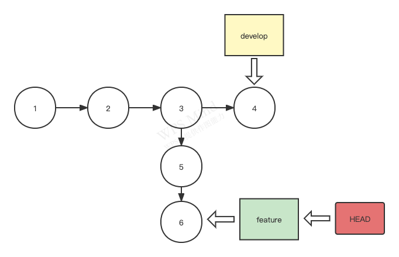
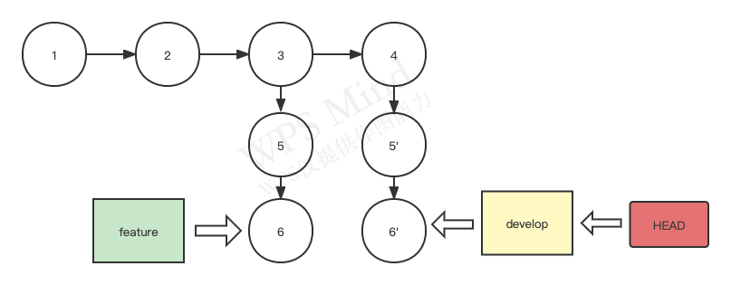
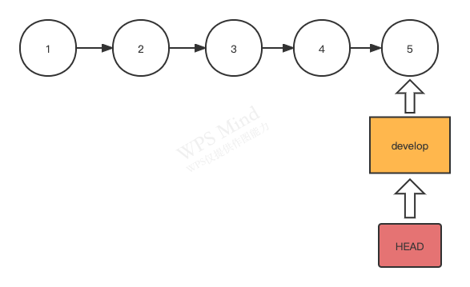
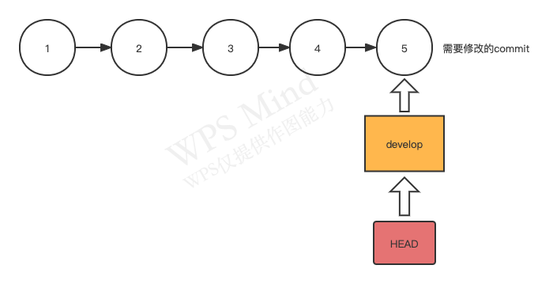
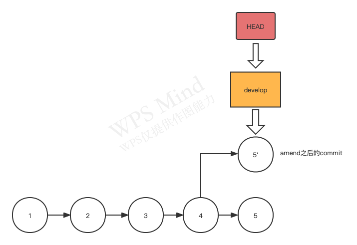

# Feature Branching

- [Feature Branching](#feature-branching)
  - [两个人协作的场景](#两个人协作的场景)
  - [什么是FeatureBranching](#什么是featurebranching)
  - [Git常用指令及其本质](#git常用指令及其本质)
    - [checkout](#checkout)
    - [rebase](#rebase)
    - [reset](#reset)
    - [commit --amend](#commit---amend)
    - [revert](#revert)
  - [.git仓库](#git仓库)
    - [HEAD](#head)

## 两个人协作的场景

当我们提交之前，要养成一个好的习惯：**一定要先去拉一下代码**

## 什么是FeatureBranching

基于feature（特性）来开分支，就是每开发一个功能或者修复一个问题，都在原分支基础上开一个新的分支，保证了开发流程的灵活性和独立性

将feature分支合并至原分支（develop）的方式一般会有两种，一种是本地合并push到远端，另一种是push自己的提交至远端然后再合并。但是不管是哪一种，为了确保不会产生冲突，都要先pull一下，避免因为其他同事的修改而产生问题

## Git常用指令及其本质

### checkout

checkout翻译为中文是查看，签出，在Git中它所承担的角色为```切换HEAD的位置```

```HEAD```的含义我们在上篇文章中提到了，它是一个永远指向当前commit的引用，当我们想要切换它的位置，实际上就是希望将自己当前的代码版本切换至另一个commit代表的代码版本。这个指令很常见，常用在切换分支中。比如当前我们在develop分支，我们希望切换至master分支进行代码合并，我们就可以使用指令：```git checkout master```。

**不是切换至某个Commit吗？为什么会被常用来切换分支**？如果产生这个疑问的话，我们需要先回顾下之前对分支的本质定义。分支实际上就是一个引用，一个指针，它所指向的一定是某个commit。只不过我们很难一直去记住某个分支最新commit的唯一标识（Hash值），所以我们就使用这个分支引用来指代这个分支的最新Commit。master所代表的就是该分支上的最新commit（假设是commit13），那么我们checkout至这个分支，实际上就是将```HEAD```移动至了commit13，代码版本也会由之前的版本回溯至commit13的代码版本

主要注意的是

- 虽然checkout常被用来切换分支，但它不只是可以做这么多。如果我们希望切换至某个commit的代码版本（假设该commit哈希值为5d882282）,我们可以使用```git checkout 5d882282```，来将```HEAD```移动至指定位置

### rebase

rebase中文翻译为变基，在GIT中它承担的角色主要是分支合并



分支合并？之前我们不是已经有了一个merge了吗？为什么还需要另一个分支合并指令？我们回想一下之前的merge指令，除了fast-forward的场景不会生成一个merge提交之外，都会生成一个merge提交。但是我们初学者往往会想，为什么不能将commit5和commit6直接放到commit4后面呢？这样也没有merge节点，看起来不是更好看吗？

我们细想下，在合并之前，commit5的父提交（旧基础）是commit3，现在我们希望他的父提交是commit4（新基础），我们希望这个指令能够改变某个提交的基础，所以我们将其称之为变基——rebase，具体指令为```git rebase feature```。



欸(•_•)?不对啊，之前图里的commit5和commit6现在怎么变成commit5'和commit6'了？而且为什么commit5父提交还是commit3？解释这个问题我们就需要回想下之前对commit的理解：**commit一经生成，就无法再被改变了，同时commit哈希值的算法中包含了其父提交**。这么一解释，我们就理解了为什么不是commit5而是commit5'了。从commit5生成的那刻起，我们就没有办法对他进行修改，不管是amend追加还是rebase变基，都是在创建一个新的提交。只不过这个提交我们没有编辑提交信息，没有手动添加至暂存区。但是，它确确实实不再是之前的commit5了。rebase做的就是帮我重新复制了一份对应commit的提交内容，并生成了新的commit。如果想要验证这个想法，可以下次注意下rebase前后commit的hash值。作为唯一标识，hash值变了，就说明已经不再原来的commit了😲

### reset

reset的中文翻译是重置，在GIT中它所承担的角色主要是移动分支引用，回溯代码版本



reset默认会保留工作区之中的内容，如果加上--hard配置的话就会抹除工作区内容

### commit --amend

>终于到追加了，这是一个十分十分十分有用的指令😁，实际上这并不是一个单独的指令，它是commit的一个属性配置，但是这个真的是十分常用

amend的中文翻译是修正。它在GIT中承担角色是修改已经提交的commit内容，请注意**只是修改提交内容**，它并无法修改commit，commit仍旧是一经生成无法修改。但是对于我们而言，已经足够了。毕竟我们初学者关注的也就只有提交内容

为什么说它很常用？假设我们现在有个不应该上传的日志打印代码被提交入了commit，那这个时候我们可以将日志打印代码先删除，然后将其添加入暂存区，下一步就不是```git commit -m "提交内容"```了，因为我们如果这么做就会生成新的commit。真正的步骤是执行```git commit --amend -m "提交内容"```，这样我们就不会生成一个新的commit，或者说生成的新commit只是上个commit去除了日志代码，同时```git log```中不会出现新的commit日志，这样有利于我们保持一个整洁的git历史

amend前的git历史



amend后的git历史



其实还有很多场景可以被使用：代码code review没有通过，需要对上一个commit做出针对性的修改；上个commit信息描述有误，需要更换commit信息······随着我们使用git频率的提升，这些场景会越来越多，而amend就可以帮我们很轻松的解决这些问题

- amend只能用于修改最新的commit内容，如果希望修改其他的commit内容，amend爱莫能助。但也并不是没有其他办法，使用交互式rebase可以达到此目的，不过由于对于初学者这种方式比较难操作，这里不再赘述

### revert

amend对commit进行的修正只能针对未push的commit，一旦commit已经被合并至了远端仓库，我们尝试amend并push的时候git会提交我们错误，这个时候就需要revert来帮我们“反悔”

revert的中文翻译是恢复，它在GIT中的作用是生成一个新的commit来撤销之前的提交内容（还是需要注意的是仅仅是提交内容，commit无法被撤销，我们只能修改其包含的内容）

## .git仓库

在项目根目录下有个隐藏文件夹.git，这个文件夹就代表了我们的本地仓库。其中有几个内容需要我们大致了解下，方便之后解决问题

### HEAD

这个文件代表了```HEAD```引用指向的内容。如果内容是一个引用，比如```refs/heads/master```，代表其指向了master分支的最新commit；如果内容是一个hash值，代表```HEAD```引用目前指向的是一个具体的commit