# GIT核心概念：一切皆引用

> 本文将会基于几个基础指令，向大家分享基础指令背后大致做了什么操作，向大家解释为什么说GIT的核心概念是引用。题外话，虽然文中的分享是基于命令行讲的，但这和可视化并不冲突。命令行也好可视化也好，都只是一个工具而已，用的顺手用哪个。我就觉得可视化巨爽，解决冲突的时候，可视化工具直接让我起飞🛫🛫🛫

- [GIT核心概念：一切皆引用](#git核心概念一切皆引用)
  - [使用方法](#使用方法)
    - [```git clone```](#git-clone)
    - [```git log```](#git-log)
    - [```git add```](#git-add)
    - [```git commit```](#git-commit)
    - [```git push```](#git-push)
    - [```git fetch```](#git-fetch)
    - [```git merge```](#git-merge)
    - [```git pull```](#git-pull)
  - [细说Commit](#细说commit)
    - [Commit是什么](#commit是什么)
    - [暂存区Staging Area](#暂存区staging-area)
    - [```git status```](#git-status)
  - [核心概念--引用](#核心概念--引用)
    - [HEAD](#head)
    - [Branch](#branch)
    - [分支合并做了什么](#分支合并做了什么)
    - [冲突Conflict](#冲突conflict)
    - [Commit能否被修改](#commit能否被修改)
    - [回看clone操作](#回看clone操作)
    - [回看push操作](#回看push操作)
    - [回看pull操作](#回看pull操作)
  - [小结](#小结)

## 使用方法

在正式开始这个部分之前，我们先简单回顾下Git基本的使用方法

### ```git clone```

假设我们需要克隆 github中的flutter项目（项目地址为<https://github.com/flutter/flutter.git>），我们可以使用```git clone https://github.com/flutter/flutter.git```，这样就会将这个项目克隆到我们本地。

- 这个命令做到的不只是简单把文件复制下来这么简单，它将远端的整个仓库，包括之前commit、branch、tag全部都拉取了下来

### ```git log```

拉取到代码之后，我们可以执行一下这个指令来看一下commit日志记录。这个指令的展示结果取决于当前处于哪个分支，在develop分支下执行这个指令就只会展示develop分支的commit日志记录。

如果我们在develop分支下想要查看master分支的commit日志记录，可以使用```git log master```

这个指令其实可以做很多事，比如查看哪个节点到哪个节点的代码变更情况，查看某位同事的所有提交记录等等，可以通过附加参数的方式实现。此处不再赘述，如有需要可以自行至git官网查阅文档

### ```git add```

假设我们想将App.js这个文件提交到**暂存区（后面会对其进行解释，目前就理解为commit文件的候选区吧）**，我们可以执行```git add App.js```指令将此文件提交至暂存区

实际工作中，如果使用命令行提交文件，我们更多的是使用```git add .```，将变更的所有文件都提交至暂存区，因为我们不太可能一个文件变一次提交一次，也不太可能修改结束后将所有的文件挨个执行```git add```

```git add .```指令执行的前提最好是项目有一个比较完善的.gitignore文件，要不然会提交很多的无用文件。.gitignore文件是我们在提交至暂存区的时候告诉git，我的哪些文件发生变更后不需要提交，常见的是一些本地配置类文件和运行时生成文件

- 需要注意的是，.gitignore只会忽略没有被添加到暂存区的文件，因为git存在本地缓存，如果文件已经纳入了版本管理，此时修改.gitignore文件是无效的

### ```git commit```

刚刚我们使用add指令添加了App.js到暂存区，现在我们感觉本次修改这些就足够了，那就可以将暂存区的文件包装一下形成一个commit，提交到我们**本地**的仓库：```git commit```，执行执行后会出现vim的编辑页面，我们可以按照vim的操作方式填写自己的commit信息：```feat：something```（后面将其称之为commit01）

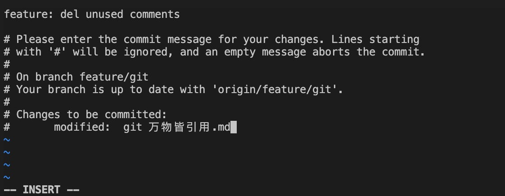

这个指令会将我们暂存区里的所有文件整合至一个commit中，目前是只有App.js，但如果暂存区还存在Home.js或者其他文件，也会被一次性整合到刚才的commit中

- 如果不想进入vim页面编辑，可以使用如下指令： ```git commit -m "feature: something"```

在执行完commit之后，如果我们再执行```git log```指令的话，就会发现现在这个分支最上面的commit信息就是我们刚刚输入的内容，这样我们就使用命令行完成了一次**本地提交**，请注意，如果此时去同事那边是看不到这个commit01的。因为我们只是提交到了自己的本地仓库，并没有提交至远端仓库

### ```git push```

如果我们认为这个commit的任务已经完成了，那我们就可以将它推送到远端，让远程仓库也拥有这部分变更代码和记录，具体指令为```git push```，执行此结果后，远端仓库就会有对应的响应

- 移动业务组的小伙伴，如果你尝试直接使用```git push```将commit推送到gerrit，你会发现报错```! [remote rejected] develop -> develop (prohibited by Gerrit)```，这个是因为Gerrit自身的一些限制。此时如果我们希望推送至远端，可以使用```git push origin refs/heads/develop:refs/for/develop```

### ```git fetch```

代码合并至远端仓库之后，同事就可以使用```git fetch```指令，将远端我们刚刚提交的commit01拉取到他的本地。但是他在develop分支会发现此时他的文件目录中并没有App.js文件，这并不是此次提交没有被拉取到花哥本地。而是被放置到了```origin/develop```分支

- origin/develop是我们本地对远端develop做的快照，我们一直在开发的develop分支一定是比origin/develop新的。我们是没有办法向本地的origin/develop分支提交代码的，这个分支的变更来源一定是```git fetch```拉取到的远端提交

### ```git merge```

如果我们希望将origin/develop刚刚的那个提交拿到自己的develop分支，可以使用```git merge origin/develop```指令，这个会将两个分支合并至一起，将origin/develop比develop分支多的那个```feature: something```提交合并过来

- 如果担心merge会有冲突产生可以考虑使用```git rebase```（例子中的具体指令为```git rebase origin/develop```）。rebase和merge两者都旨在将变更代码从一个分支合并至另一个分支（例子中的从origin/develop到develop）

### ```git pull```

默认情况（不附加任何参数），```git fetch``` + ```git merge FETCH_HEAD```等价于```git pull```，也就是说例子中的整个拉取合并流程可以被```git pull origin develop```替代（HEAD后面会解释其含义）

## 细说Commit

### Commit是什么

commit记录了我们针对上个commit产生的改动，同时```git log```中每个commit后面的哈希值是其唯一标识。这个hash值的计算方法是比较复杂的，大致根据提交信息、提交者、提交日期、变更代码hash值计算而来（SHA-1）

commit哈希的计算规则就决定了在一个项目中，每个commit的hash值都不可能会重复，这也就是为什么它可以被作为唯一标识

### 暂存区Staging Area

刚才我们执行```git add```的时候，解释这个操作是将提交的内容放置暂存区。以下根据git官网上的图来解释其含义：


我们对代码变更的时候，基本可以分为以下几种变更：新增文件、删除文件、修改文件。git必须要对所有文件追踪，才可以知晓两个commit之间的变更内容，同事```git commit```操作就是将git追踪的所有变更包装为一个新的commit。

当我们新增文件的时候，文件新增是要告诉git的；当我们删除文件的时候，这个文件的消失也是要告诉git的；变更也是同样的道理。我们将文件及变更加入git存储追踪的区域，就是暂存区。

- 暂存区的作用不再详细解释，具体可以参考：<https://stackoverflow.com/questions/49228209/whats-the-use-of-the-staging-area-in-git>

### ```git status```

这个指令用于查看当前工作区和暂存区状态，不会对本地仓库进行修改操作，它就像linux下的```ls```查看目录文件一样，用于查看当前的本地状态。

主要被展示的状态有两个，一个是处于工作区的文件，一个是处于暂存区的文件。其中处于工作区的文件又可以被细分为未被追踪的（untracked）和追踪但发生变更的（edit but not staged）

这个命令一般就是看一下当前暂存区有哪些改动，工作区还有没有遗漏的改动没有被添加至暂存区。如果习惯可视化工具来操作GIT，这个指令不需要关注。可视化工具一般会在文件名上标注颜色来示意文件变更

- 可能会出现一个文件既在暂存区，又在工作区的情况。这两个区域存放的不是具体的文件，而是针对文件的改动。处于暂存区的只是上次```git add```操作添加的改动，而工作区标识了除了暂存区的改动，还有其他改动存在且未被添加至暂存区

## 核心概念--引用

千呼万唤始出来,接下来我们讲解引用在GIT中的作用。对于GIT而言，引用就是一个**指向某个提交某个commit的指针**，这个含义和Java的指针比较类似，只不过一个是指向版本的，一个是指向变量的。引用可以指向一个commit，也可以指向一个引用

### HEAD

HEAD是比较特殊的一个引用，它是永远指向工作目录的当前版本。每次我们执行commit或者merge或者rebase的时候，它都会跟着移动到最新的位置

就像我们刚clone下来仓库的时候，HEAD就是指向仓库的最新提交。当我们执行完commit01的时候，HEAD又会指向这个最新的提交

### Branch

branch是一类代表分支的引用，像刚才提到的develop、origin/develop，就是两个引用一个指向了develop分支代表的最新提交，一个指向了origin/develop分支代表的最新提交

往往HEAD就是指向一个分支引用，因为我们往往会在一个分支的最新提交处工作，而HEAD又是指向了当前提交。比如刚才我们刚刚clone下代码的时候，有一个引用指向了develop分支的最新提交（分支引用），而我们又是在这个提交处进行修改，所以HEAD就会指向这个分支引用

之所以HEAD指向分支引用而很少直接指向引用（***很少但可以，这种场景叫做detach。一般很少用到，后面会带一下***），是因为我们往往会关注自己在那个分支上工作，而很少关注自己在那个提交上工作

- 在仓库被刚clone下来的时候，HEAD默认指向master分支，因为master是所有仓库的默认分支

所以分支并不是像树一样，新长出了一个枝条，而仅仅是一个引用。这也就是GIT分支创建代价小的缘故，对于GIT而言，创建一个分支就只是创建了一个指针，指向了一个引用，并不会有任何的文件拷贝操作，也并不会产生新的副本。同样地，切换分支的代价也很小，就是一个HEAD位置的切换。删除分支的代价也很小，就是一个指针的删除。

- 创建一个分支，可以使用指令```git branch 分支名```

- 查看所有的分支，可以使用指令```git branch```

- 切换至另一个分支，可以使用指令```git checkout 分支名```

- 如果我们希望切换至另一个分支，但这个分支目前还不存在，可以使用指令```git checkout -b 分支名```，它会帮我们把新分支创建出来，并自动将HEAD引用指向新分支引用

- 如果我们希望删除某个分支（一般都是本地分支操作），可以使用指令```git branch -d 分支名```

### 分支合并做了什么

假设我们现在需要在develop分支（已存在commit01）上开发一个新的功能，我们希望开一个新的分支，以防对develop分支产生干扰。我们可以先执行```git checkout -b feature/commit2```，这样就会创建出一个feature/commit2分支，且HEAD引用指向此分支引用。我们开发结束之后，产生新提交commit02，此时由于我们需要提交至远程仓库的develop，所以必须先将feature/commit2和develop分支合并一下。

首先执行指令```git checkout develop```，切换回develop分支。此时我们如果```git log```查看提交日志，会发现commit02并不在记录中。然后执行```git merge feature/commit2```，会将feature/commit2分支合并至develop分支。此时再使用```git log```查看日志，就会发现刚刚的commit已经出现在了提交记录中

- 如果执行命令的过程中仔细指令结果，我们会发现```Fast-forward（ff）```快速向前，这个代表了feature/commit2分支完全领先develop分支，develop分支并没有比feature/commit2分支多出任何一个提交。这种合并是比较简便，也不会出问题的

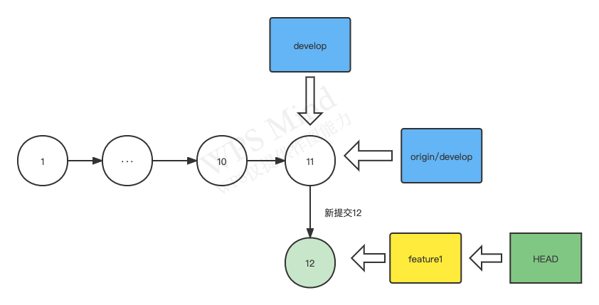

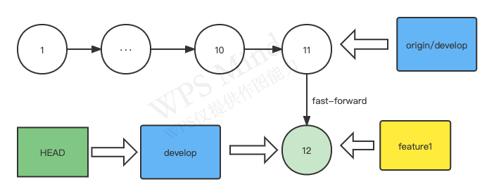

### 冲突Conflict

当我们尝试去merge分支的时候，一定是希望快速前进，不要产生冲突的（反正我是及其及其及其不乐意解决冲突）。但是往往事与愿违，冲突经常会伴随着merge产生。

首先我们先解释下冲突为什么产生。假设我们修改一个文件的第九行，恰巧同事也修改这个文件的第九行，放置到了他的最新提交中。并且两个修改不相同，这个时候冲突就产生了。不是说我和同事产生了冲突（也不是不可能），而是**git无法区分应该应用哪个commit中的修改，当git无法做主的时候，选择权就会抛到我们手上，冲突会终止merge进程。直至我们解决冲突，继续合并**。

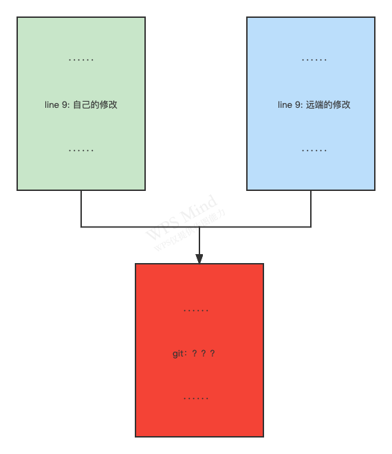

解释完冲突之后，我们再来看大多数的合并分支应该是什么样的。假设我们希望将feature1分支合并至develop分支，feature1分支存在自己的独特commit12，develop存在自己的独特commit13，两者合并后（不管有没有冲突）会生成新的commit14来表示这次合并操作。

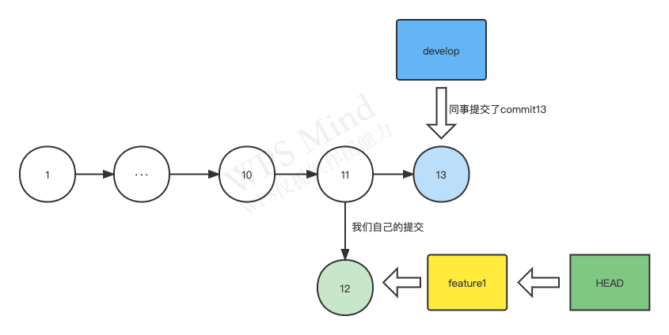

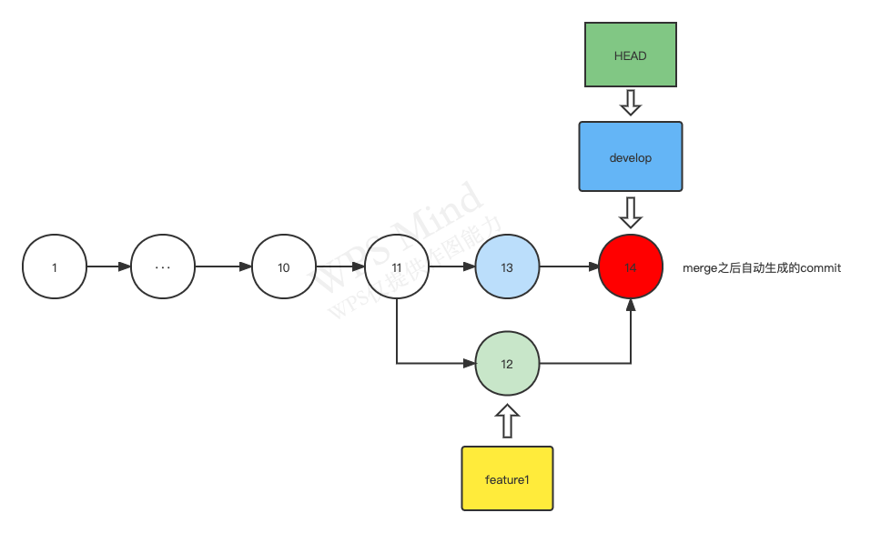

- 如果我们希望一个快速前进的合并不要快速合并，必须生成新的commit。可以使用指令```git merge --no-ff 分支名```，强制不采取fast-forward方式

### Commit能否被修改

**任何操作都不会导致Commit被修改，它就像一个历史节点一样，一经生成就不会再发生变化，无法被修改，无法被擦除**。知晓这个概念的好处就是，当我们代码希望回到某个commit版本的时候，不管有没有被merge，有没有被revert，有没有被amend，甚至对应的分支都被删除了，都可以回溯回去（简而言之就是出了事儿别慌，只是之前commit过，即使没有push到远端，本地仓库一样可以回溯）

- 虽然分支被删除了，但是分支只是一个引用，一个指针。对应的commit还是放在它的父节点身后，只不过没有一个branch将它展示到可视化工具中。在.git文件夹中有个logs目录，这个目录里会有HEAD移动的日志，里面会详尽的包含了HEAD的移动顺序，我们可以利用这个日志在可视化工具不显示该commit的情况下，回溯该commit版本

### 回看clone操作

clone的整个操作流程：首先取下远端仓库的所有分支（develop和master），然后会把远端分支的镜像也取下来（origin/develop和origin/master），将来我们执行的fetch操作只会将远端提交补充至远端镜像（origin/develop和origin/master），且本地HEAD永远不会指向远端镜像，它们俩只是对远端分支做的快照，这两个引用的修改方式只有fetch操作。接下来就是将分支引用对应的commit取下，并依次追溯其父节点，直至根节点。这样，我们就拥有了远端仓库的完整版本历史

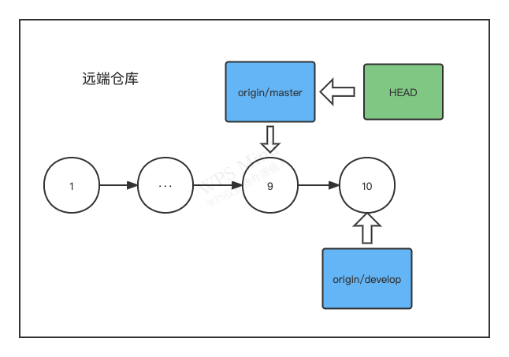

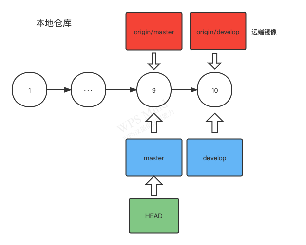

### 回看push操作

假设我们新增了commit11，希望将其推送至远程仓库

push的整个操作流程：首先将HEAD指向的引用推送至远端（develop分支引用），然后会将分支引用指向的commit推送至远端，最后将提交的commit之前的所有commit依次推送，直至远端的最新commit。最后远端HEAD也会指向最新的分支引用（develop），同时我们的本地远端镜像（origin/develop）也会跟着更新。到此，push的所有流程就已经结束了

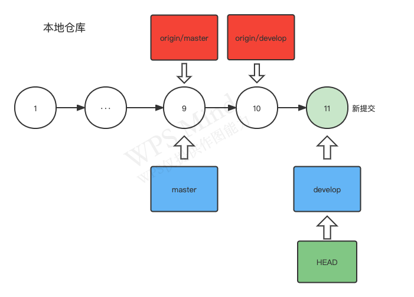
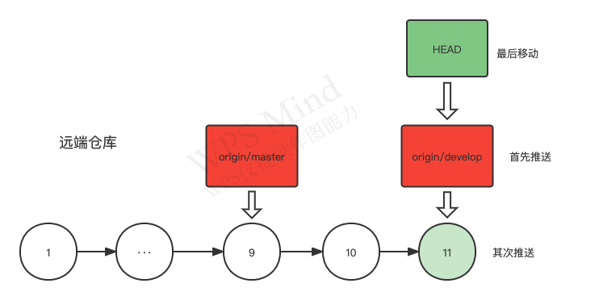

### 回看pull操作

假设现在远端仓库新增的commit12，且master分支指向commit11。此时我们本地分支最新commit为11，且master分支和origin/master分支指向commit9

pull的整个流程：首先执行```git fetch```，将远端镜像更新到本地（origin/master指向commit11，origin/develop未指向commit），并将缺失的commit更新到本地（更新commit12，并让origin/develop指向它）。然后执行```git merge origin/develop```（之所以是develop，是因为我们现在处于develop分支），然后会fast-forward，develop分支引用直接指向commit12，同时本地HEAD会跟着develop分支引用移动

- 注意此时的本地master分支引用并未发生改变，仍旧指向commit9。只有当我们切换至master分支，且执行```git merge origin/master```操作后，master分支引用才会移动至commit11

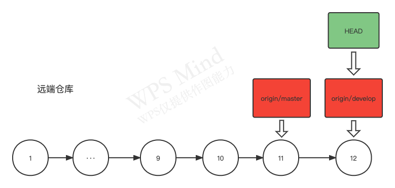

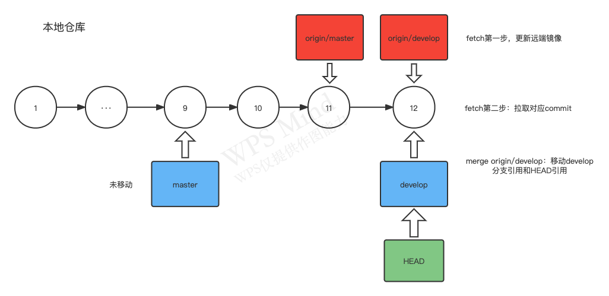

## 小结

至此，我们对GIT基本操作的讲解就已经结束了。我们文中提到了```git clone```、```git commit```、```git push```、```git push```几种操作的使用方式和基本原理，还简单解释了一下HEAD是什么、分支引用是什么。看完此文，应该就可以算是可以使用GIT了，至少有了一些自己的理解。但是还有一些问题我们没有提到：

- 如何在已经生成commit之后再向这个提交中补充内容？

- 除了merge有没有其他的分支合并方式？

- 我不想要某个远程提交，想要后悔怎么办？

- 我想回到过去的某个版本，基于它进行修改怎么做？

- 我刚刚写了commit信息，但是我不需要这个本地commit了怎么做？

- 我本地代码被覆盖了/误删了代码但是没有commit，我该怎么办？

- 大家说的feature branching是什么？

- 大家说的git flow是什么？

- 可视化工具的那个操作背后都有什么？

这些问题我将会在下篇文章做出自己的解释，向大家分享我自己的想法。如果大家觉得我有哪些不对的地方，欢迎指正修改。（记得一键三连）
